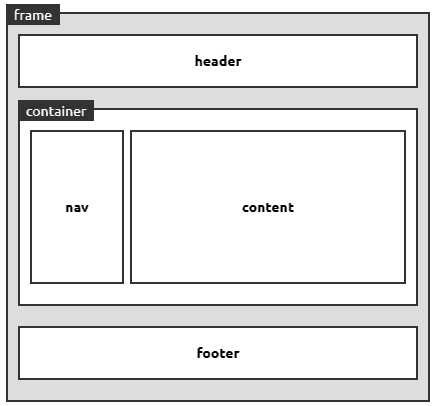

# 1. Vue에 대해서

## 1.1 Vue의 소개

Vue는 React와 Angular과 더불어 프론트엔드 프레임워크 3대장 중 하나이다. 특히 Vue는 React와 Angular보다 쉽고 빠르고 저 둘의 장점을 가지고 있기 떄문에 사용하기 좋습니다.


## 1.2 Vue의 특징

Vue는 UI 화면 개발 방법 중 하나인 MVVM 패턴의 뷰 모델에 해당하는 화면단 라이브러리입니다.

MVVM 패턴이란 화면을 모델(Model) - 뷰(View) - 뷰 모델(ViewModel)로 구조화하여 개발하는 방식을 의미합니다.

| 뷰   | 뷰 모델 | 모델              |
| ---- | ------- | ----------------- |
| 돔   | 뷰      | 자바스크립트 객체 |


뷰는 사용자에게 비춰지는 화면을 의미하고 이떄 어떠한 버튼을 클릭하면 어떠한 동작이 일어나는데 이때 돔 리스너에서 버튼의 클릭을 감지하고 모델에서 필요한 데이터를 가져와 화면에 나타냅니다.

이처럼 뷰에서 동작을 일으키는걸 감지 그리고 이벤트가 일어났을 때 모델에서 필요한 데이터를 가져오는 것을 뷰 모델이 담당하게 도비니다.

또한 컴포넌트 기반 프레임워크로 레고 블록처럼 컴포넌트를 조합하여 화면을 구성할 수 있습니다.

또한 리액트의 단방향 데이터 흐름, 앵귤러의 양방향 데이터 바인딩의 장점을 모두 결합했습니다.

> **양방향 데이터 바인딩**
>
> 화면에 표시되는 값과 프레임워크의 모델 데이터 값이 동기화되어 한쪽이 변경되면 다른 한쪽도 자동으로 변경되는 것

> **단방향 데이터 흐름**
>
> 컴포넌트의 단방향 통신을 의미하는것으로 컴포넌트 간에 데이터를 전달할 때 항상 상위 컴포넌트에서 하위 컴포넌트 한 방향으로만 전달하는 구조

# 2. Vue 시작하기

```html
<script src="https://cdn.jsdelivr.net/npm/vue/dist/vue.js"></script>

<body>
    <div id="app-1">
        {{message}}
    </div>
</body>

<script>
    const app1 = new Vue({
        el: '#app-1',
        data: {
            message: 'Hello Vue',
        },
    });
</script>
```

첫번째 <script>는 뷰 라이브러리를 로딩 두번째 <script>는 메세지를 출력하기 위한 뷰 인스턴스를 만들고 <div id="app-1">에  적용했습니다.

이제 실행해보면 화면에 Hello Vue가 떠있습니다. 이를 좀 더 자세히 알아봅시다.

# 3. 화면을 개발하기 위한 인스턴스

## 3.1 뷰 인스턴스

뷰 인스턴스는 뷰로 화면을 개발하기 위해 필수적으로 생성해야 하는 기본 단위입니다. 위에서 봤듯이 우리는 new Vue({})로 뷰 인스턴스를 생성해 사용했습니다.

```html
<script>
    const app1 = new Vue({
        el: '#app-1',
        data: {
            message: 'Hello Vue',
        },
    });
</script>
```

app1이라는 뷰 인스턴스를 살펴보면 el 속성과 data 속성을 사용했습니다. el과 data외에도 다양한 속성들이 있습니다.

| 속성     | 설명                                                         |
| -------- | ------------------------------------------------------------ |
| el       | 뷰 인스턴스가 그려질 지점을 정의, 이때 css 선택자를 사용     |
| data     | 뷰 인스턴스에서 사용할 데이터를 정의                         |
| template | 화면에 표시할 HTML, CSS 등의 마크업 요소를 정의하는 속성. 뷰의 데이터 및 기타 속성들도 함께 화면에 그릴 수 있음 |
| methods  | 화면 로직 제어와 관계된 메서드를 정의하는 속성. 마우스 클릭 이벤트 처리와 같이 화면의 전반적인 이벤트와 화면 동작과 관련된 로직을 추가할 수 있습니다. |
| created  | 뷰 인스턴스가 생성되자마자 실행할 로직을 정의할 수 있는 속성 |

## 3.2 뷰 인스턴스 유효 범위

뷰 인스턴스를 생성하면 HTML의 특정 범위 안에서만 옵션 속성들이 적용되어 나타납니다. 이를 인스턴스의 유효 범위라 하는데 이때 지역 컴포넌트와 전역 컴포넌트의 차이점에서 중요하게 다뤄집니다. 또한 el 속성과도 밀접한 관계가 있습니다.

이를 쉽게 알아보기 위해 인스턴스가 생성된 후 어떻게 적용되는지 알아봅시다.

1. 뷰 라이브러리 파일 로딩
2. 인스턴스 객체 생성(옵션 속성 포함) 
3. 특정 화면 요소에 인스턴스를 붙임 
4. 인스턴스 내용이 화면 요소로 변환 
5. 변환된 화면 요소를 사용자가 최종 확인

```html
<!-- 1. 뷰 라이브러리 파일 로딩 -->
<script src="https://cdn.jsdelivr.net/npm/vue/dist/vue.js"></script>

<body>
    <!-- 3. 특정 화면 요소에 인스턴스를 붙임  -->
    <div id="app-1">
        <!-- 4. 인스턴스 내용이 화면요소로 변환 -->
        {{message}}
    </div>
</body>

<script>
	// 2. 인스턴스 객체 생성(옵션 속성 포함) 
    const app1 = new Vue({
        el: '#app-1',
        data: {
            message: 'Hello Vue',
        },
    });
</script>

<!-- 5. 실행 후 화면이 {{message}}가 아닌 Hello Vue로 보인다. -->
```

위의 코드에서 {{message}}가 <div id="app-1">의 범위에서 벗어나게 되면 Hello vue로 변환되지 않고 그대로 화면에 뜨게 된다. 이는 인스턴스의 유효 범위에서 벗어나서이다.

## 3.3 뷰 인스턴스 라이플 사이클

뷰 인스턴스 속성 중 created 는 뷰 인스턴스가 생성된 후 실행되는 로직을 적는데 이처럼 뷰 인스턴스의 상태에 따라 호출할 수 있는 속성을 **라이플 사이클**이라 하고 라이플 사이클 속성에서 실행되는 로직을 **라이플 사이클 훅**이라 합니다.


라이플 사이클 속성들을 하나씩 살펴보자

**1. beforeCreate**

**인스턴스가 생성되고 가장 처음으로 실행되는 라이플 사이클 단계**입니다. 이 단계에서는 data, methods 속성이 아직 인스턴스에 정의되어 있지 않고, 돔과 같은 화면 요소에도 접근할 수 없습니다.

**2. created**

beforeCreate 라이플 사이클 단계 다음에 실행되는 단계입니다. data 속성과 methods 속성이 정의되기 때문에 this.data, this.fetchData()와 같은 로직들을 이용하여 data 속성과 methods 속성에 정의된 값에 접근하여 로직을 실행할 수 있습니다. 다만 아직 인스턴스가 화면 요소에 부착되기 전이므로 template 속성에 정의된 **돔 요소에 접근할 수 없습니다.**

**3. beforeMount**

created 단계 이후 template 속성에 지정한 마크업 속성을 render() 함수로 변환한 후 el 속성에 지정한 **화면 요소(돔)에 인스턴스를 부착하기 전**에 호출되는 단계입니다. render() 함수가 호출되기 직전 로직을 추가하기 좋습니다.

**4. mounted**

el 속성에서 지정한 화면 요소에 인스턴스가 부착되고 나면 호출되는 단계로, template 속성에 정의한 **화면 요소(돔)에 접근할 수 있어 화면 요소를 제어하는 로직**을 수행하기 좋은 단계입니다. 다만, 돔에 인스턴스가 부착되자마자 바로 호출되기 때문에 하위 컴포넌트나 외부 라이브러리에 의해 추가된 화면 요소들이  최종 HTML 코드로 변환되는 시점과 다를 수 있습니다.

**5. beforeUpdate**

el 속성에서 지정한 화면 요소에 인스턴스가 부착되고 나면 인스턴스에 정의한 속성들이 화면에 치환됩니다. 치환된 값은 **뷰의 반응성**을 제공하기 위해 $watch 속성으로 감시합니다. 이를 데이터 감시라 합니다. 

> **뷰의 반응성**
>
> 뷰의 특징 중 하나로 코드의 변화에 따라 화면이 반사적으로 반응하여 빠르게 화면을 갱신하는 것을 의미함

또한 관찰하고 있는 데이터가 변경되면 가상 돔으로 화면을 다시 그리기 전 호출되는 단계이며 변경 예정인 새로운 데이터에 접근할 수 있어 변경 예정 데이터의 값과 관련된 로직을 미리 넣을 수 있습니다. 다만 여기서 값을 변경하는 로직을 넣더라고 화면에 다시 그려지지는 않습니다.

**6. updated**

데이터가 변경되고 나서 가상 돔으로 다시 화면을 그리고나면 실행되는 단계입니다. 데이터 변경으로 인한 화면 요소 변경까지 완료된 시점이므로, **데이터 변경 후 화면 요소 제어와 관련된 로직**을 추가하기 좋은 단계입니다. 다만 이 단계에서 데이터 값을 변경하면 무한 루프에 빠질 수 있기 때문에 값을 변경하려면 computed, watch와 같은 속성을 사용해야 합니다. 따라서 **데이터 값을 갱신하는 로직은 가급적 beforeUpdate**에 추가하고 update에서는 변경 데이터의 화면 요소(돔)와 관련된 로직을 추가하는 것이 좋습니다.

**7. beforeDestroy**

뷰 인스턴스가 파괴되기 직전에 호출되는 단계입니다. 이 단계에서는 아직 인스턴스에 접근이 가능합니다. 따라서 **뷰 인스턴스의 데이터를 삭제하기 좋은 단계입니다.**

**8. destroyed**

뷰 인스턴스가 파괴되고 나서 호출됩니다.


```html
<body>
    <div id="app-1">
        {{message}}
    </div>
</body>
<script src="https://cdn.jsdelivr.net/npm/vue/dist/vue.js"></script>
<script>
    new Vue({
        el: '#app-1',
        data: {
            message: 'Hello Vue.js',
        },
        beforeCreate() {
            console.log('beforeCreate');
        },
        created() {
            console.log('created');
        },
        mounted() {
            console.log('mounted');
        },
        updated() {
            console.log('updated');
        },
    });
</script>
```

위의 뷰 코드를 실행하면 위의 순서대로 beforeCreate -> created -> mounted가 출력이 된다.

이때 updated 함수는 호출되지 않는데 데이터 변경이 일어나지 않아서 입니다

```html
<body>
    <div id="app-1">
        {{message}}
    </div>
</body>
<script src="https://cdn.jsdelivr.net/npm/vue/dist/vue.js"></script>
<script>
    new Vue({
        el: '#app-1',
        data: {
            message: 'Hello Vue.js',
        },
        beforeCreate() {
            console.log('beforeCreate');
        },
        created() {
            console.log('created');
        },
        mounted() {
            console.log('mounted');
            this.message = "Hello VVue!"
        },
        updated() {
            console.log('updated');
        },
    });
</script>
```

위 코드와 같이 마운트 후 message 데이터를 변경하면 업데이트가 일어나고 화면이 바뀌게 된다.


# 4. 화면을 개발하기 위한 컴포넌트

## 4.1 컴포넌트에 대해

컴포넌트란 조합하여 화면을 구성할 수 있는 블록을 의미합니다. 컴포넌트를 활용하여 빠르게 구조화하여 개발할 수 있습니다.

블록으로 나누면 재활용하기도 쉽고 관리도 편하고 남이 작성한 코드도 알기 쉬워집니다.



위의 사진을 가지고 컴포넌트를 나누게 된다면

frame -> header, container, footer이 있고 container안에는 nav, content가 있다.

이는 화면 전체를 3개의 컴포넌트로 나누고  1개의 컴포넌트를 다시 2개의 하위 컴포넌트로 나눠서 관리하는 것이다.

## 4.2 전역 컴포넌트 등록하기

```vue
Vue.component('컴포넌트 이름', {
	// 컴포넌트 내용
})
```

전역 컴포넌트 등록 형식에서 컴포넌트 이름과 내용이 있습니다.

- 컴포넌트 이름 : template 속성에서 사용할 HTML 사용자 정의 태그 이름
  - 태그 이름 명명 규칙인 '모두 소문자', '케밥 기법'을 따르지 않아도 괜찮습니다.
- 컴포넌트 내용 : 실제 화면의 HTML 요소로 변활될 때 표시될 속성들
  - template, data, methods 등 인스턴스 옵션 속성 정의

예제를 살펴보자

```php+HTML
<body>
    <div id="app-1">
        {{message}}
        <my-component></my-component>
    </div>
</body>
<script src="https://cdn.jsdelivr.net/npm/vue/dist/vue.js"></script>
<script>
    Vue.component('my-component', {
        template: '<div>전역 컴포넌트가 등록되었습니다.</div>',
    });

    new Vue({
        el: '#app-1',
        data: {
            message: 'Hello Vue.js',
        },
    });
</script>
```

이때 동작 순서는

1. 뷰 라이브러리 파일 로딩
2. 뷰 생성자로 컴포넌트 등록 -> Vue.component
3. 인스턴스 객체 생성
4. 특정 화면 요소에 부착
5. 인스턴스 내용 변환 -> <my-component>가 <div>로 변환됨
6. 변환된 화면 요소를 사용자가 최종 확인


## 4.3 지역 컴포넌트 등록

지역 컴포넌트는 전역 컴포넌트와 다르게 인스턴스에 components 속성을 추가하고 등록할 컴포넌트의 이름과 속성을 정의합니다.

```html
<body>
    <div id="app-1">
        {{message}}
        <my-component></my-component>
    </div>
</body>
<script src="https://cdn.jsdelivr.net/npm/vue/dist/vue.js"></script>
<script>
    new Vue({
        el: '#app-1',
        data: {
            message: 'Hello Vue.js',
        },
        components: {
            'my-component': {
                template: '<div>전역 컴포넌트가 등록되었습니다.</div>',
            },
        },
    });
</script>
```

이때 해당 객체를 변수로 설정 후 사용해도 됩니다.

## 4.4 지역, 전역 컴포넌트 차이

```html
<body>
    <div id="app-1">
        {{message}}
        <my-local-component></my-local-component>
        <my-global-component></my-global-component>
    </div>
    <div id="app-2">
        <my-global-component></my-global-component>
        <my-local-component></my-local-component> <!-- 나타나지 않음 -->
    </div>
</body>
<script src="https://cdn.jsdelivr.net/npm/vue/dist/vue.js"></script>
<script>
    Vue.component('my-global-component', {
        template: '<div>전역 컴포넌트가 등록되었습니다.</div>',
    });

    new Vue({
        el: '#app-1',
        data: {
            message: 'Hello Vue.js',
        },
        components: {
            'my-local-component': {
                template: '<div>지역 컴포넌트가 등록되었습니다.</div>',
            },
        },
    });

    new Vue({
        el: '#app-2',
    });
</script>
```

아주 간단히 설명하면 전역 컴포넌트는 모든 인스턴스에서 사용이 가능하지만 지역 컴포넌트는 다른 인스턴스에서는 사용할 수 없다.


## 4.5 컴포넌트 간 통신

Angular.js나 백본과 같은 초창기 자바스크립트 프레임워크에서는 한 화면을 1개의 뷰로 간주했습니다. 그렇기 때문에 한 화면의 데이터를 화면 어디서든지 호출할 수 있었습니다.

하지만 Vue의 경우는 컴포넌트로 화면을 구성하므로 같은 웹 페이지라도 데이터를 공유할 수 없습니다. 이는 컴포넌트 마다 고유한 유효 범위를 갖기 때문입니다.

```html
<body>
    <div id="app">
        <my-component1></my-component1>
        <my-component2></my-component2>
    </div>
</body>
<script src="https://cdn.jsdelivr.net/npm/vue/dist/vue.js"></script>
<script>
    const cmp1 = {
        template: '<div>첫 번째 지역 컴포넌트 : {{ cmp1Data }} </div>',
        data: function () {
            return {
                cmp1Data: 100,
            };
        },
    };

    const cmp2 = {
        template: '<div>두 번째 지역 컴포넌트 : {{ cmp2Data }} </div>',
        data: function () {
            return {
                cmp2Data: cmp1.data.cmp1Data,
            };
        },
    };

    new Vue({
        el: '#app',
        components: {
            'my-component1': cmp1,
            'my-component2': cmp2,
        },
    });
</script>
```

분명히 cmp2는 cmp1의 cpm1Data를 참조했는데 화면에 제대로 뜨지 않는다. 이는 my-component2에서 my-component1에 직접 접근할 수 없기 때문입니다.

## 4.6 데이터 전달 방법

**상-하위 컴포넌트**

가장 기본적인 데이터 전달 방법은 상우 - 하위 컴포넌트 간 데이터 전달 방식입니다.

보통 트리 형태를 생각하면 쉬운데 위에서 배운 방법으로 지역 또는 전역 컴 컴포넌트를 등록하면 자연히 하위 컴포넌트가 되고 이때 컴포넌트를 등록한 인스턴스는 상위 컴포넌트가 됩니다.

이때 **상위 컴포넌트에서 하위 컴포넌트는 props**를 전달할 수 있고 **하위 컴포넌트에서 상위 컴포넌트는 이벤트**만을 전달할 수 있습니다.

```html
<body>
    <div id="app">
        <child-component v-bind:propsdata="message"></child-component>
    </div>
</body>
<script src="https://cdn.jsdelivr.net/npm/vue/dist/vue.js"></script>
<script>
    Vue.component('child-component', {
        props: ['propsdata'],
        template: '<p>{{ propsdata }} </p>',
    });

    new Vue({
        el: '#app',
        data: {
            message: 'Hello Vue! passed from Parent Component',
        },
    });
</script>
```

이는 상위 컴포넌트인 인스턴스에서 하위 컴포넌트인 전역 컴포넌트로 message를 전달하여 메세지를 출력하는 것 입니다.

즉 여기서는 `new Vue() -> Vue.component()`로 new Vue()에 있는 message를 Vue.compoennt()로 전달합니다. Vue.component는 props을 어떠한 이름으로 사용할지 정의하고 컴포넌트 태그에서 v-bind를 사용하여 상위 컴포넌트의 message를 전달받아 사용합니다.

---

이번에는 하위에서 상위로 이벤트를 전달하는 방법을 봅시다.

> **하위에서 상위로 데이터를 전달하는 방법은 절대 불가능한가?**
>
> 절대로 불가능하지는 않지만 뷰의 단방향 데이터 흐름에 어긋나기 때문에 알 필요가 없습니다.
>
> 하지만 추후에 복잡한 뷰 애플리케이션을 구축할 때 이벤트 버스를 사용하여 데이터를 전달해야 할 경우가 있습니다.  데이터 버스를 공부할 때 다시 배웁시다.

이벤트 발생과 수신은 $emit()과 v-on: 속성을 사용하여 구현합니다.

```vue
// 이벤트 발생
this.$emit('이벤트명');

// 이벤트 수신
<child-component v-on:이벤트명="상위 컴포넌트의 메서드명"></child-component>
```

간단한 예제를 살펴봅시다.

```html
<body>
    <div id="app">
        <child-component v-on:show-log="printText"></child-component>
    </div>
</body>
<script src="https://cdn.jsdelivr.net/npm/vue/dist/vue.js"></script>
<script>
    Vue.component('child-component', {
        template: '<button v-on:click="showLog">show</button>',
        methods: {
            showLog: function () {
                this.$emit('show-log');
            },
        },
    });

    new Vue({
        el: '#app',
        data: {
            message: 'Hello Vue! passed from Parent Component',
        },
        methods: {
            printText: function () {
                console.log('received an event');
            },
        },
    });
</script>
```

커스텀 컴포넌트 태그에서는 v-on:하위 컴포넌트 이벤트명="상위 컴포넌트 이벤트명"

하위 컴포넌트에서는 template에서는 v-on:이벤트="이벤트명" 그리고 methods에서 이벤트를 정의합니다.

상위 컴포넌트에서는 어떠한 이벤트를 발생할건지 정의해줍니다. 여기서는 methods의 printText입니다.

---

**같은 레벨의 컴포넌트 간 통신**

이제까지는 뷰의 기본적은 컴포넌트 통신 방법을 알아봤습니다. 이번에는 같은 레벨 컴포넌트의 통신 방법을 알아보겠습니다.

하지만 뷰에서는 같은 레벨의 컴포넌트에서 보낼 수 있는 방법이 없으므로 상위 컴포넌트로 이벤트를 전달한 후 상위 컴포넌트에서 하위 컴포넌트로 props로 넘겨주야 합니다.

하지만 이러한 통신 구조는 상위 컴포넌트가 없어도 되는데 강제로 두어야 하므로 이를 해결하는 방법이 **이벤트 버스**입니다.

## 4.7 이벤트 버스

이벤트 버스는 관계 없는 컴포넌트 간 통신 방법입니다. 아래는 이벤트 버스의 형식입니다.

```js
// 이벤트 버스를 위한 추가 인스턴스 1개 생성
const eventBus = new Vue();

// 이벤트를 보내는 컴포넌트
methods: {
    메서드명: function(){
        eventBus.$emit('이벤트명', 데이터);
    }
}

// 이벤트를 받는 컴포넌트
methods: {
    created: function(){
        envenBus.$on('이벤트명', function(데이터){
            ...
        });
    }
}
```

그럼 이제 간단한 예제를 살펴보자

```html
<body>
    <div id="app">
        <child-component></child-component>
    </div>
</body>
<script src="https://cdn.jsdelivr.net/npm/vue/dist/vue.js"></script>
<script>
    const eventBus = new Vue();
    Vue.component('child-component', {
        template: '<div>하위 컴포넌트 영영. <button v-on:click="showLog">show</button></div>',
        methods: {
            showLog: function () {
                eventBus.$emit('triggerEventBus', 100);
            },
        },
    });

    const app = new Vue({
        el: '#app',
        created() {
            eventBus.$on('triggerEventBus', function (value) {
                console.log(`이벤트를 전달받음, 전달받은 값 : ${value}`);
            });
        },
    });
</script>
```

