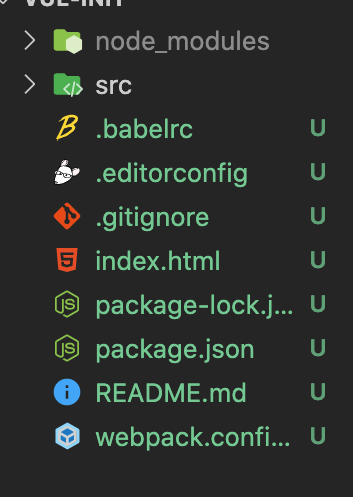
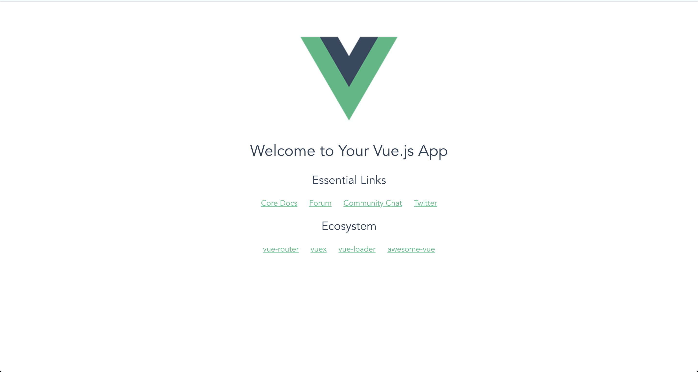

# 1 뷰 프로젝트

지금까지는 HTML 파일에서 뷰 코드를 작성했었는데 여러 불편한 점이 있습니다.

먼저 template에서 HTML 태그를 사용하는 것도 힘들고 알아보기도 힘듭니다. 이를 해결하는 방법을 알아봅시다.

## 1.1 싱글 파일 컴포넌트 체계

싱글 파일 컴포넌트 체계는 .vue 파일로 프로젝트 구조를 구성하는 방식을 말합니다. 이때 아래와 같은 구조를 가집니다.

```html
<template>
  <!-- HTML 태그 내용 -->
</template>

<script>
  export default {
    // 자바스크립트 내용
  };
</script>

<style>
  /* CSS 스타일 내용 */
</style>
```

그렇다면 간단한 예제를 살펴보자

```vue
<template>
  <div>
    <span>
      <button>{{ message }}</button>
    </span>
  </div>
</template>

<script>
export default {
  data: {
    messag: 'click this button',
  },
};
</script>

<style>
span {
  font-size: 1.2em;
}
</style>
```

그렇다면 우리가 직접 하나하나 다 만들어야 할까? 아니다 .vue를 웹 브라우저가 인식할 수 있는 형태의 파일로 변환해주는 웹팩같은 번들러가 필요한데 이를 하나하나 설정해서 만들어도 되지만 편하게 프로젝트를 구성할 수 있는 뷰 CLI가 있다 아래에서 자세히 알아보자

## 1.2 뷰 CLI

뷰 CLI는 뷰 프로젝트를 간단히 만들 수 있는 도구로 커맨드 창에서 명령어로 간단히 뷰 프로젝트를 구성할 수 있습니다.

터미널에 `npm install vue-cli -global`을 입력하여 뷰 CLI를 전역에서 사용할 수 있도록 설치하고 실행하면 됩니다.

뷰 CLI의 명령어를 알아봅시다.

| 템플릿 종류                | 설명                                                                           |
| -------------------------- | ------------------------------------------------------------------------------ |
| vue init webpack           | 고급 웹팩 기능을 활용한 프로젝트 구성 방식, 테스팅, 문법 검사 등을 지원        |
| vue init webpack-simple    | 웹팩 최소 기능을 활용한 프로젝트 구성 방식. 빠른 화면 프로토타이핑용           |
| vue init browserify        | 고급 브라우저파이 기능을 활용한 프로젝트 구성방식. 테스팅, 문법 검사 등을 지원 |
| vue init browserify-simple | 브라우저파이의 최소 기능을 활용한 프로젝트 구성 방식. 빠른 화면 프로토타이핑용 |
| vue init simple            | 최소 뷰 기능만 들어간 HTML 파일 1개 생성                                       |
| vue init pwa               | 웹팩 기반의 프로그레시브 웹앱 기능을 지원하는 뷰 프로젝트                      |

템플릿의 내용은 다 다르지만 전체적인 맥략은 2가지로 살펴보면 됩니다.

1. 웹팩이나 브라우저파이 같은 모듈 번들러를 프로젝트 자체에 포함하여 바로 사용 가능합니다
2. .vue 파일을 HTML, CSS, JS 파일로 변환해 주기 위한 뷰 로더를 포함합니다.

우리는 가장 간단한 `vue init webpack-simple`로 간단한 작업을 진행해봅시다.



그러면 위와 같은 폴더 구조가 생깁니다. 각각의 파일에 대해 알아봅시다.

1. node_modules : npm install로 다운받은 라이브러리가 존재하는 위치
2. src : .vue 파일을 비롯하여 애플리케이션이 동작하는 데 필요한 로직이 들어갈 위치
3. index.html : 뷰로 만든 웹앱의 시작점, npm run dev 실행 시 로딩되는 파일
4. Package.json : npm 설정 파일 뷰 애플리케이션이 동작하는 데 필요한 라이브러리들을 정의하는 파일
5. Web pack.config : 웹팩 설정 파일. 웹팩 빌드를 위해 필요한 로직들을 정의하는 파일

package.json의 내용을 살펴보자

```json
{
  // 프로젝트 정보
  "name": "vue-init",
  "description": "vue CLI test",
  "version": "1.0.0",
  "author": "clowns",
  "license": "MIT",
  "private": true,

  // npm 실행 명령어
  "scripts": {
    "dev": "cross-env NODE_ENV=development webpack-dev-server --open --hot",
    "build": "cross-env NODE_ENV=production webpack --progress --hide-modules"
  },

  // 뷰 웹팩 관련 라이브러리
  "dependencies": {
    "vue": "^2.5.11"
  },
  "browserslist": ["> 1%", "last 2 versions", "not ie <= 8"],
  "devDependencies": {
    "babel-core": "^6.26.0",
    "babel-loader": "^7.1.2",
    "babel-preset-env": "^1.6.0",
    "babel-preset-stage-3": "^6.24.1",
    "cross-env": "^5.0.5",
    "css-loader": "^0.28.7",
    "file-loader": "^1.1.4",
    "vue-loader": "^13.0.5",
    "vue-template-compiler": "^2.4.4",
    "webpack": "^3.6.0",
    "webpack-dev-server": "^2.9.1"
  }
}
```

이러한 package.json파일이 있으면 환경이 달라져도 npm install or yarn add을 실행하여 필요한 라이브러리를 다운 받아 똑같은 환경을 만들 수 있습니다.

이제 실제 실행을 해봅시다. npm run dev을 커맨드창에 쳐봅시다.



그렇다면 훌륭한 뷰 웹앱이 실행이 된 것 입니다.

## 1.3 뷰 로더

뷰 로더는 웹팩에서 지원하는 라이브러리입니다. 싱글 파일 컴포넌트 체계에서 사용하는 .vue 파일의 내용을 브라우저에서 실행할 수 있는 웹 페이지 형태로 변환해 줍니다. 그러면 웹팩에서 뷰 로더가 어떻게 설정되어 있는지 확인해 봅시다.

```json
module: {
    rules: [
      {
        test: /\.css$/,
        use: ['vue-style-loader', 'css-loader'],
      },
      {
        test: /\.vue$/,
        loader: 'vue-loader',
        options: {
          loaders: {},
          // other vue-loader options go here
        },
      },
```

test는 대상 파일 use는 사용할 로더를 지정하는 것 입니다.
이렇게 뷰 CLI로 생성한 프로젝트 폴더에 뷰 로더를 알아서 만들어 주니 웹팩을 몰라도 어느정도는 만들 수 있습니다. 물론 웹팩을 알면 좀 더 세밀한 설정이 가능합니다.

# 2. 뷰 실전 애플리케이션

## 2.1 할 일 관리 앱

프론트엔드 프레임워크를 공부할 때는 할 일 관리 앱은 꼭 구현해 봐야 합니다. 실무에서 서비스를 만들 때 사용하는 데이터 조작 방법인 삽입, 조회, 변경, 삭제를 간단한 코드로 구현해 볼 수 있기 때문입니다. 실제 기업들은 이러한 데이터 조작 방법에서 크게 벗어나지 않습니다.

## 2.2 프로젝트를 시작해봅시다.

`vue init webpack-simple`로 새로운 vue-cli를 만들어 봅시다.

